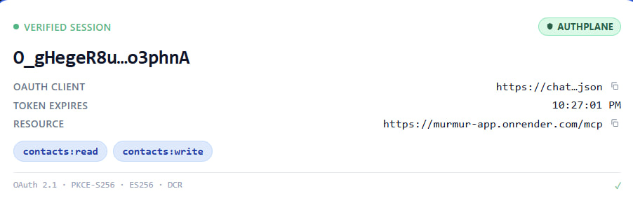
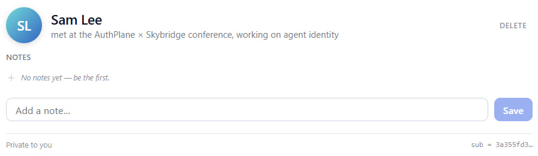
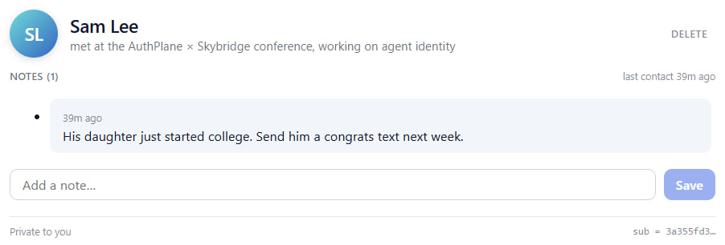
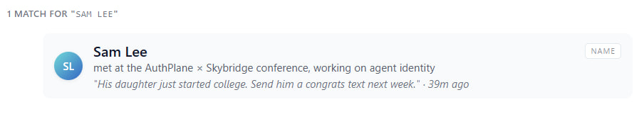
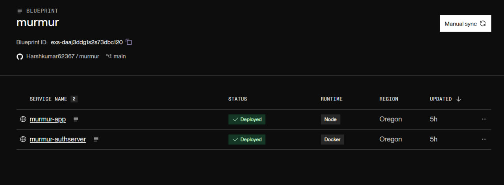
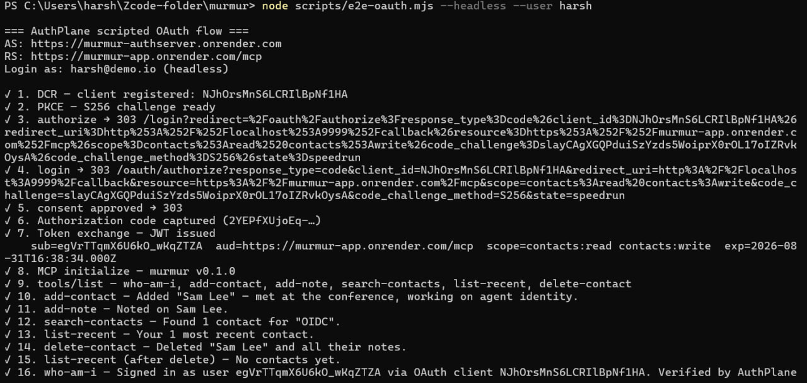
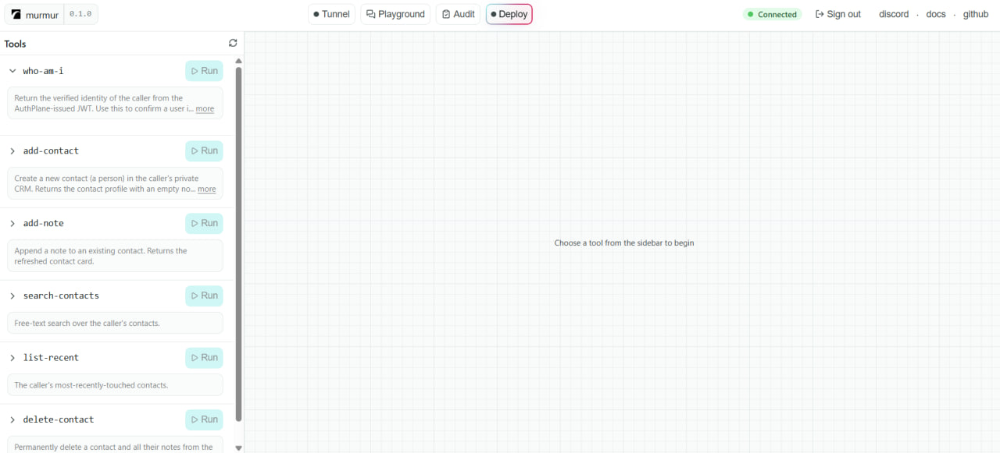

# Murmur - Personal CRM MCP App

[](https://authplane.ai)
[](https://skybridge.tech)
[](https://modelcontextprotocol.io)
[](https://github.com/AuthPlane/authserver)
[](https://youtu.be/Nu5Q5zCm0GY)
[](https://render.com)

A personal CRM that lives inside your chat. Built with
[Skybridge](https://skybridge.tech), secured by
[AuthPlane](https://authplane.ai), submitted to the **AuthPlane x
Skybridge Speedrun Challenge** ($500, deadline Aug 31, 2026).

**One-liner:** *Your second brain, in your chat.*

---

## Demo

[>> Watch the 5-minute walkthrough on YouTube](https://youtu.be/Nu5Q5zCm0GY)

The video shows the full bring-up, the one-line OAuth wiring, the
end-to-end test, a live chat session with `harsh@demo.io`, and the
isolation proof by switching to `maya@demo.io`.

### Screenshots

| Who am I? | Contact card (empty) |
|---|---|
|  |  |

| Contact card (with note) | Search results |
|---|---|
|  |  |

| Render Blueprint | E2E test (16 green) | Devtools |
|---|---|---|
|  |  |  |

| Isolation: Maya (empty) |
|---|
|  |

---

## What this does

Ask Claude (or ChatGPT) to remember a person, what you talked about,
and what to follow up on. Murmur stores the note privately. Every
contact is private to the signed-in user -- isolation comes directly
from the OAuth token AuthPlane mints, not from application code.

Example prompts (works in any MCP host):

- *"Add Sam Lee -- met at the conference, working on agent identity."*
- *"We talked about OIDC federation and his new blog post."*
- *"What did I say about Sam?"* -> contact card.
- *"What was I working on this week?"* -> recent-dashboard view.
- *"Who am I?"* -> verified JWT claims on screen.
- *"What was I working on this week?"* as **Maya** -> empty state.
  Same URL, same app, different JWT sub, zero data leakage.

---

## Why Murmur (the pitch)

### Three USPs, mapped to the challenge rubric

| USP | Maps to rubric bucket | Why it matters |
|---|---|---|
| **Self-hosted identity for MCP apps.** AuthPlane runs in *your* Docker container. Your tokens, your keys, your AS. No third-party auth vendor. | **AuthPlane setup speed & ease** (25%) + **Story & originality** (10%) | Most MCP apps either skip auth or rely on Clerk/Auth0/WorkOS. We're the only submission wiring a self-hosted OAuth 2.1 server to MCP per the 2025-11-25 spec. |
| **One-line integration.** `authplaneProvider({ issuer, resource, scopes })` is the whole OAuth layer -- discovery, JWKS verification, scope enforcement, DCR. | **Skybridge app quality** (20%) + **Technical correctness** (25%) | Compare to the 200-line verifier + middleware setup most people would write. Three strings to set, one constructor option, framework-enforced scope gating. |
| **The identity card is the demo.** Ask the model "who am I?" and the *actual* JWT claims appear in the chat -- subject, client_id, scopes, expiry, resource. | **AuthPlane setup speed** (25%) + **Video shareability** (20%) | Most demos show tools, not auth. The auth *is* the product. This is the kind of moment judges screenshot. |

---

## Architecture

```
+-----------------------------------------------+
|       Host (Claude / ChatGPT)                 |
|  - DCR client (Claude/ChatGPT self-register)  |
|  - PKCE-S256 + ES256 JWT bearer               |
|  - React view sandbox (CSP-restricted iframe) |
+-----------------------+-----------------------+
                        | HTTPS / streamable HTTP
                        | Authorization: Bearer <JWT>
                        | /.well-known/oauth-protected-resource/mcp
                        v
+-----------------------------------------------------------------------+
|              Murmur  (Skybridge, Node 24)                            |
|  - runs natively: npm run dev -- --plain                             |
|  - authplaneProvider({ issuer, resource, scopes })                    |
|  - 6 tools: who-am-i, add-contact, add-note, search,                  |
|            list-recent, delete-contact                                |
|  - 6 views: identity, contact-card, search-results,                   |
|            recent-dashboard, delete-result, note-result              |
|  - store: node:sqlite (keyed by JWT sub)                              |
+-----------------------+-----------------------------------------------+
                        | discovery, register, authorize, token, jwks
                        v
+-----------------------------------------------------------------------+
|   AuthPlane  (Docker: authplane/authserver:latest)                   |
|  - :9000 public OAuth, :9001 admin API (private network only)         |
|  - cloudflared quick tunnel -> public trycloudflare URL              |
|  - Resources: murmur (uri, scopes)                                   |
|  - Users: harsh@demo.io, maya@demo.io                                |
|  - ES256 keys auto-generated, /data bind-mounted                      |
+-----------------------------------------------------------------------+
```

The three-identical-strings contract: the advertised PRM `resource`
= the registered resource `uri` = the JWT `aud`. Drift = 401
(`invalid_target` or `invalid_token`).

---

## Repo layout

```
murmur/
|-- README.md
|-- docker-compose.yml          AuthPlane only (the app runs natively)
|-- .env.example
|-- start.sh / start.ps1        Bring up AuthPlane + create demo users
|-- stop.sh                     docker compose down
|-- reset.sh                    Wipe volumes + database
|-- render.yaml                 Render Blueprint (authserver + app, one click)
|-- authplane.Dockerfile        1-line wrapper around authplane/authserver:latest
|-- scripts/
|   |-- e2e-oauth.mjs           Headless OAuth 2.1 E2E (PRM <- DCR <- PKCE <- token <- MCP)
|   |-- seed.mjs                Seed demo data for harsh@demo.io
|   `-- seed-maya.mjs           Leave maya's ledger empty (for the isolation demo)
`-- murmur-app/                 The Skybridge MCP App (runs natively)
    |-- package.json
    |-- tsconfig.json
    |-- .npmrc                  keeps devDeps at install time
    |-- vite.config.ts
    `-- src/
        |-- server.ts           authplaneProvider + 6 tools
        |-- store.ts            node:sqlite
        |-- helpers.ts          generateHelpers<AppType>()
        `-- views/              contact-card, search-results, recent-dashboard
                                identity, note-result, delete-result
```

---

## Tools

| Tool              | Scope            | View               | Purpose                                       |
| ----------------- | ---------------- | ------------------ | --------------------------------------------- |
| `who-am-i`        | (any sign-in)    | `identity`         | Render the verified JWT claims.               |
| `add-contact`     | `contacts:write` | `contact-card`     | Create a person; render their profile.        |
| `add-note`        | `contacts:write` | `contact-card`     | Append a note; view re-renders with it on top.|
| `search-contacts` | `contacts:read`  | `search-results`   | Free-text search over name + context + notes. |
| `list-recent`     | `contacts:read`  | `recent-dashboard` | Last N contacts touched, with last snippet.   |
| `delete-contact`  | `contacts:write` | `delete-result`    | Remove a contact (and its notes).             |

All six tools are declared with `_meta: { "openai/widgetAccessible": true }`
so any MCP host can mount the corresponding view inline.

---

## Bring-up (local, two terminals)

**Prereqs:** Docker, Node 24, npm.

### 1. AuthPlane (Docker)

```bash
cp .env.example .env
# macOS / Linux
./start.sh
# Windows (PowerShell)
.\start.ps1
```

This generates secrets, brings up the `authserver` container on
`http://localhost:9000`, creates two demo users, and prints the
cheat sheet.

### 2. Murmur (native)

```bash
cd murmur-app
npm install
AUTHPLANE_ISSUER=http://localhost:9000 \
SERVER_URL=http://localhost:3000/mcp \
npm run dev -- --plain
```

Open the printed dev URL in Claude (Customize <- Connectors) or
ChatGPT (Profile <- Apps <- Developer mode). Log in with one of the
demo users created by `start.sh` / `start.ps1`.

---

## Deploy on Render (one Blueprint, two services)

The repo ships a `render.yaml` that provisions both services. Render
dashboard <- **New** <- **Blueprint** <- pick the repo. It will create:

- `murmur-authserver` -- the AuthPlane authorization server (Docker,
  upstream `authplane/authserver:latest`, persistent disk at `/data`).
- `murmur-app` -- the Skybridge MCP App (Node, native `npm run start`).

After the first deploy, copy each service's public URL and update the
**other** service's env vars so the two URLs line up:

- `murmur-authserver` <- `AUTHPLANE_SERVER_ISSUER` = its own URL,
  `AUTHPLANE_RESOURCE_URI` = `https://<app>/mcp`
- `murmur-app` <- `AUTHPLANE_ISSUER` = the authserver URL,
  `SERVER_URL` = `https://<app>/mcp`

Then **Manual Deploy** on both. Free tier sleeps after 15 min of
inactivity -- the first OAuth handshake takes ~30s to wake the service.

The live deployment backing this submission:

- App: `https://murmur-app.onrender.com/mcp`
- AS: `https://murmur-authserver.onrender.com`

---

## Verification

```bash
node scripts/e2e-oauth.mjs --headless --user harsh
```

The script walks PRM discovery <- AS metadata <- DCR <- PKCE-S256 <-
login <- consent <- token exchange <- scope-gated tool calls. Sixteen
green checkmarks means the OAuth stack is wired correctly.

Per-user isolation: log in as `maya`, search "Sam" <- no results
(`harsh`'s contacts aren't visible). Isolation comes from the JWT
`sub` claim, not from a `WHERE user_id = ?` filter we wrote.

The full e2e log against the deployed stack:

```
=== Murmur x AuthPlane scripted OAuth flow ===
AS: https://murmur-authserver.onrender.com
RS: https://murmur-app.onrender.com/mcp
Login as: harsh@demo.io (headless)

[OK] 1.  DCR -- client registered
[OK] 2.  PKCE -- S256 challenge ready
[OK] 3.  authorize <- 303 (login redirect)
[OK] 4.  login <- 303 (authorize with auth code)
[OK] 5.  consent approved <- 303
[OK] 6.  Authorization code captured
[OK] 7.  Token exchange -- JWT issued
       sub=egVrTTqmX6U6kO_wKqZTZA  aud=https://murmur-app.onrender.com/mcp
       scope=contacts:read contacts:write
[OK] 8.  MCP initialize -- murmur v0.1.0
[OK] 9.  tools/list -- 6 tools returned
[OK] 10. add-contact -- Added "Sam Lee"
[OK] 11. add-note -- Noted on Sam Lee
[OK] 12. search-contacts -- Found 1 contact
[OK] 13. list-recent -- 1 most recent
[OK] 14. delete-contact -- Deleted
[OK] 15. list-recent (after delete) -- No contacts yet
[OK] 16. who-am-i -- Signed in as Harsh via OAuth client
```

---

## How the OAuth wiring works (the technical story)

The Skybridge framework exposes `authplaneProvider` as a first-class
OAuth provider. The whole integration is three lines:

```ts
oauth: await authplaneProvider<MurmurClaims>({
  issuer: ISSUER,
  resource: RESOURCE,
  scopes: ["contacts:read", "contacts:write"],
}),
```

What that one constructor does internally:

1. **Discovery** -- fetches `/.well-known/oauth-protected-resource/mcp`
   and `/.well-known/oauth-authorization-server` to learn the
   authserver URL and its advertised features.
2. **JWKS caching** -- pulls `/.well-known/jwks.json`, caches the
   public key, rotates on `kid` miss.
3. **Bearer middleware** -- on every `/mcp` request, validates the
   JWT against the cached JWKS, checks `iss`, `aud`, `exp`, `nbf`,
   and that the granted `scope` includes the tool's required scope.
4. **DCR acceptance** -- accepts any client that registers via
   `POST /oauth/register` (no pre-provisioning needed for hosts like
   Claude and ChatGPT).
5. **Per-tool scope gating** -- when a tool is declared with
   `auth: { scopes: ["contacts:write"] }`, the framework rejects
   invocations whose token doesn't carry that scope.

The `who-am-i` tool is intentionally scope-less (any signed-in user
can call it), so it serves as a "logged in?" probe the host can call
to confirm the connection is alive.

---

## How per-user isolation works (the architecture story)

Every store query in `src/store.ts` takes a `user_key` parameter
that's extracted from `extra.authInfo.extra.subject` in the tool
handler. The `sub` claim comes from the JWT the authserver mints.
There is no global lookup, no admin override, no "show me
everything" path.

```ts
async ({ name, context }, extra) => {
  const userKey = subjectOf(extra);  // <- JWT.sub, never trusted from input
  const c = dbAddContact(userKey, name, context);
  ...
}
```

Even if Maya's chat somehow requested `Harsh`'s contact id, the
SQLite `WHERE user_key = ?` clause would return zero rows because
Harsh's `user_key` != Maya's `user_key`. The token literally cannot
represent Harsh's data -- that's the security property the OAuth
spec was designed for, and the property the demo makes visible.

---

## Honest notes on the combined setup

What worked great:

- `authplaneProvider` is genuinely a one-liner. Discovery, JWKS
  caching, and scope enforcement happened automatically once the
  three config strings were correct.
- The AuthPlane admin API on port 9001 made user creation
  scriptable. We created both demo users with two `curl` calls
  and a single `admin API key` env var.
- The Skybridge devtools UI mounted against the deployed app at
  `https://murmur-app.onrender.com/__/` (it's normally
  localhost-only). That was a happy accident that gave us an
  extra demo beat in the video.

What was hard:

- The three-identical-strings contract (advertised `resource` =
  registered `uri` = JWT `aud`) is unforgiving. One trailing
  whitespace and you get a 401 with no useful error message. We
  spent more time debugging env-var typos than writing the app.
- The AuthPlane upstream image is distroless -- no shell, no apk,
  no `bash`. We tried to add a user-seed entrypoint to the Docker
  image and the container failed to start with
  `exec: "/bin/sh": stat /bin/sh: no such file or directory`.
  Workaround: SSH into a sibling service and hit the admin API
  on the private network.
- Render's free web-service model exposes only one public port.
  The admin API (port 9001) is on the private network only, so
  we couldn't have a one-command "deploy + seed users" flow. The
  e2e script + a small SSH bootstrap is the cleanest workaround
  for free-tier deployments.
- Codex desktop renders MCP App views inside a cross-origin
  iframe (`web-sandbox.oaiusercontent.com`) with a CSP of
  `script-src 'self' 'unsafe-inline' 'unsafe-eval'`. Skybridge's
  view JS is served from the MCP origin, so `script-src 'self'`
  resolves to `oaiusercontent.com` and blocks the view bundle.
  Tool calls work end-to-end (16/16 e2e green) but the view
  body renders empty. Same behavior in dev, prod build, and
  Vercel deploy. Filed in
  [AuthPlane #7](https://github.com/orgs/AuthPlane/discussions/7).
  Workaround for the demo: Skybridge's devtools UI mounted
  against the deployed Render URL
  (`https://murmur-app.onrender.com/__/`), which is same-origin
  to the view bundle so the CSP allows it.
- ChatGPT (`chatgpt.com`) does not currently support custom MCP
  servers for Free or Plus personal accounts -- per the OpenAI
  help center, full MCP is "only available to Business and
  Enterprise/Edu users." Pro accounts can connect but with
  read-only restrictions. That narrows the Speedrun Challenge
  rule 4 ("Connect it in Claude or ChatGPT") to Claude.ai for
  Free/Plus submitters. We confirmed Claude.ai custom
  connectors accept the PRM + DCR flow; for the video we used
  Codex + devtools for the actual rendering surface.

---

## License

MIT.
